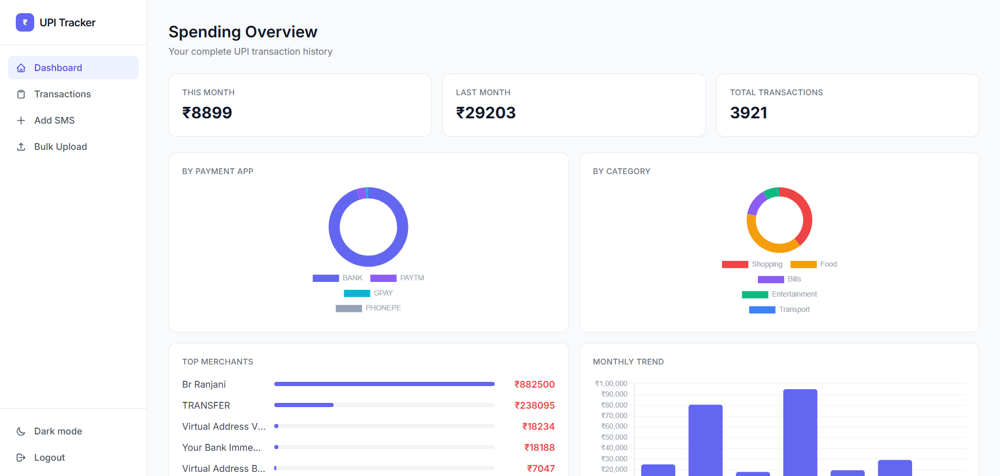
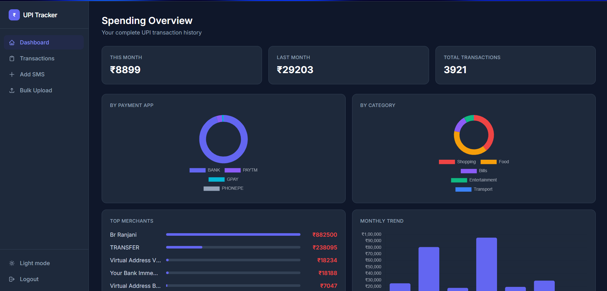
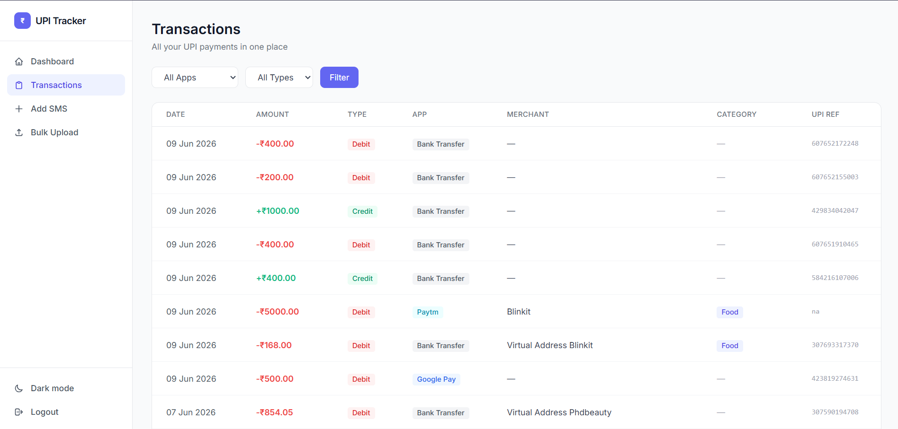
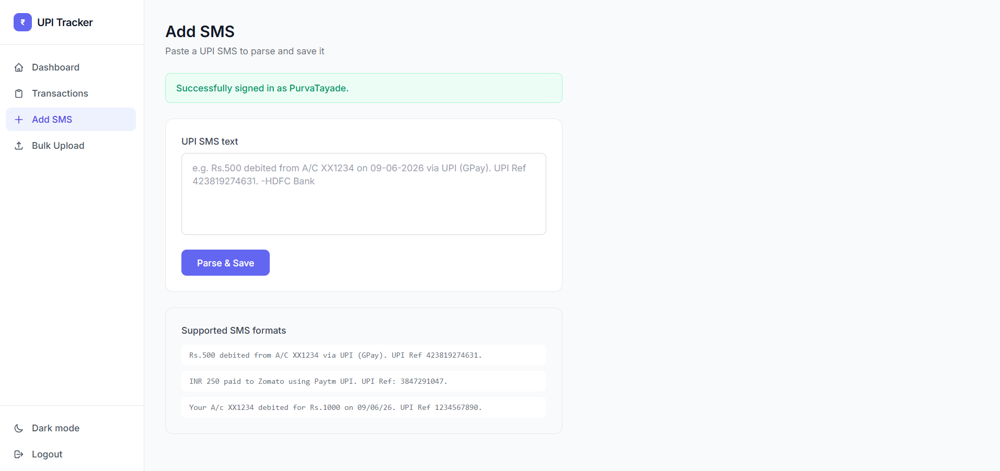
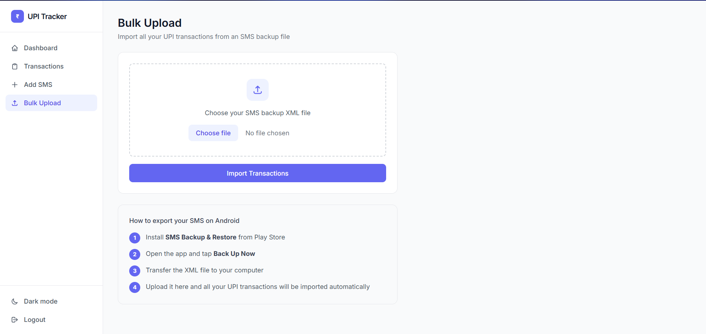

# UPI Tracker

A unified dashboard to track all your UPI payments across GPay, PhonePe, Paytm, and bank transfers — in one place.

Built because most people in India use 2-3 payment apps depending on what's open, making it impossible to get a clear picture of monthly spending.

🔗 **Live Demo:** https://upitracker-production.up.railway.app

---

## The Problem

You pay with GPay at a restaurant, Paytm for a Blinkit order, PhonePe because a friend requested it. At the end of the month, your spending is scattered across 3 apps with no unified view. UPI Tracker solves this by parsing your SMS notifications — which every UPI app sends without exception — and giving you one clean dashboard.

---

## Features

- **SMS Parser** — paste any UPI SMS and it extracts amount, payment app, merchant, date, and UPI reference automatically
- **Bulk XML Import** — export your entire SMS history from Android and import thousands of transactions at once
- **Unified Dashboard** — spending by payment app, by category, top merchants, monthly trend charts
- **Auto-categorisation** — transactions tagged as Food, Shopping, Transport, Entertainment, Bills automatically
- **Transaction List** — filter by payment app, transaction type, search by merchant
- **REST API** — JWT authenticated endpoints for all data (built for future Android companion app)
- **Dark mode** — full light/dark theme toggle

---

## Tech Stack

| Layer | Technology |
|---|---|
| Backend | Django 6, Django REST Framework |
| Auth | django-allauth, JWT (SimpleJWT) |
| Database | PostgreSQL (production), SQLite (local) |
| Frontend | Tailwind CSS, Chart.js, Alpine.js |
| Deployment | Railway |
| SMS Parsing | Python regex |

---

## How the SMS Parser Works

Every UPI transaction triggers an SMS from your bank regardless of which app you used. These follow predictable patterns:

Rs.500 debited from A/C XX1234 on 09-06-2026 via UPI (GPay). UPI Ref 423819274631.

INR 250 paid to Zomato using Paytm UPI. UPI Ref: 3847291047.

The parser uses regex to extract amount, transaction type, payment app, merchant name, date, and UPI reference from these messages. For bulk import, users export their SMS history as XML using the Android app "SMS Backup & Restore" and upload it — the parser processes each message and skips duplicates using UPI reference numbers.

---

## API Endpoints
POST /api/auth/token/              → Get JWT access + refresh tokens

POST /api/auth/token/refresh/      → Refresh access token
GET  /api/transactions/            → List all transactions (with filters)

POST /api/transactions/            → Create a transaction

POST /api/transactions/parse-sms/  → Parse an SMS and save as transaction
GET  /api/dashboard/               → Spending summary data

---

## Local Setup

```bash
# Clone the repo
git clone https://github.com/yourusername/upitracker.git
cd upitracker

# Create virtual environment
python -m venv venv
venv\Scripts\activate  # Windows
source venv/bin/activate  # Mac/Linux

# Install dependencies
pip install -r requirements.txt

# Create .env file
echo SECRET_KEY=your-secret-key > .env
echo DEBUG=True >> .env

# Run migrations
python manage.py migrate

# Create superuser
python manage.py createsuperuser

# Start server
python manage.py runserver
```

---

## Project Structure
upitracker/

├── accounts/          # Custom user model, auth

├── api/               # DRF API endpoints, serializers

├── parsers/           # SMS parser logic, XML bulk upload

├── transactions/      # Transaction model, dashboard, list views

├── templates/         # Base layout, auth pages

└── upitracker/        # Django settings, URLs

---

## Roadmap

- [ ] Android companion app — reads SMS in background, auto-syncs to API
- [ ] Push notifications for large transactions
- [ ] Monthly spending reports via email
- [ ] Split bill tracker with friends
- [ ] Google Play Store release

---

## Screenshots





---

Built by P
